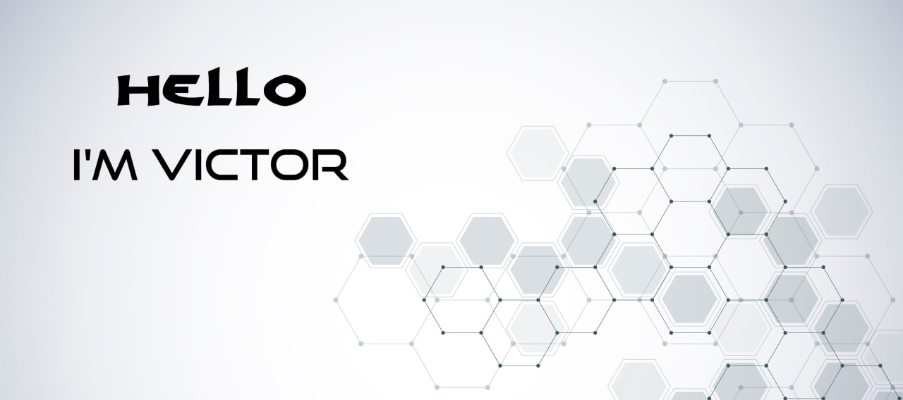
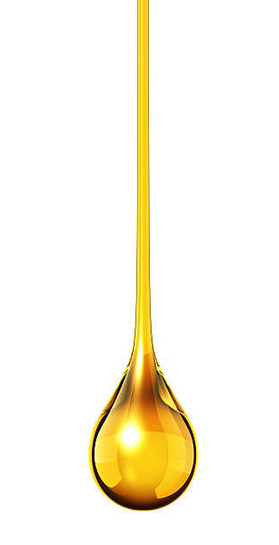

  

<h2 align="center">ɪ'ᴍ ᴀ ᴊᴀᴠᴀꜱᴄʀɪᴘᴛ ꜰᴜʟʟꜱᴛᴀᴄᴋ ᴅᴇᴠᴇʟᴏᴘᴇʀ</h2>
<h3 align="center">ɪ ʟɪᴋᴇ ᴛᴏ ɪᴍᴘʟᴇᴍᴇɴᴛ ᴄᴏᴍᴘʟᴇx ᴘʀᴏᴊᴇᴄᴛꜱ, ꜰɪɴᴅ ᴇʟᴇɢᴀɴᴛ ꜱᴏʟᴜᴛɪᴏɴꜱ,   ᴏᴘᴛɪᴍɪᴢᴇ ɪɴᴇꜰꜰɪᴄɪᴇɴᴛ ᴏɴᴇꜱ.     🄰🄽🄳  🄸  🄻🄸🄺🄴  🄷🄾🄽🄴🅈! </h3>

ɪ'ᴍ ᴀ ᴊᴀᴠᴀꜱᴄʀɪᴘᴛ ꜰᴜʟʟꜱᴛᴀᴄᴋ ᴅᴇᴠᴇʟᴏᴘᴇʀ

             

<!--
**VictorKarvatsky/VictorKarvatsky** is a ✨ _special_ ✨ repository because its `README.md` (this file) appears on your GitHub profile.

Here are some ideas to get you started:

- 🔭 I’m currently working on ...
- 🌱 I’m currently learning ...
- 👯 I’m looking to collaborate on ...
- 🤔 I’m looking for help with ...
- 💬 Ask me about ...
- 📫 How to reach me: ...
- 😄 Pronouns: ...
- ⚡ Fun fact: ...
-->
